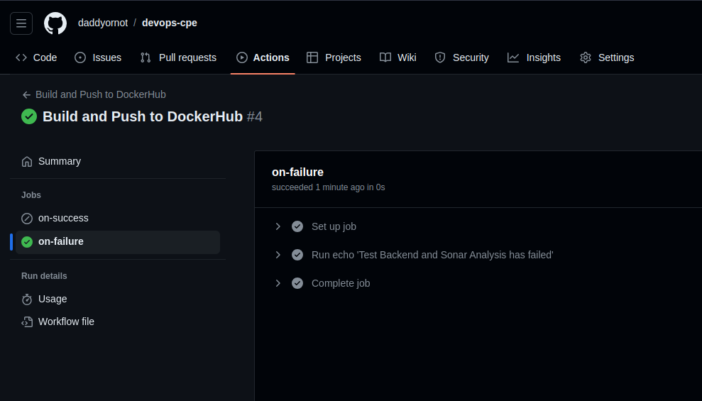
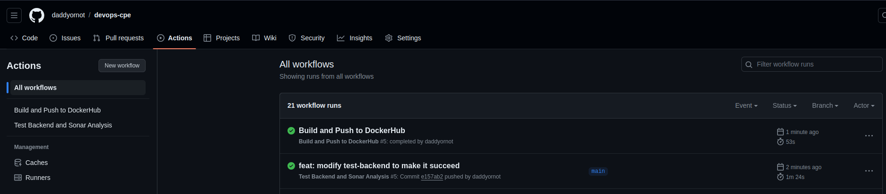

### MAILHEBIAU Damien - 4IRC

# TP1 - Docker

## 1-1 Document your database container essentials: commands and Dockerfile.

## Architecture finale
```sh
╰─ tree                                                   
.
├── compose.override.yml
├── compose.yml
├── database
│   ├── CreateScheme.sql
│   ├── Dockerfile
│   └── InsertData.sql
├── httpd
│   ├── Dockerfile
│   ├── httpd.conf
│   └── index.html
├── java
│   ├── Dockerfile
│   ├── Main.class
│   └── Main.java
├── readme.md
└── spring
    └── simple-api-student
        ├── Dockerfile
        ├── HELP.md
        ├── pom.xml
        ├── README.md
        └── src
            ├── main
            │   ├── java
            │   │   └── fr
			...
            │   └── resources
            │       └── application.yml
            └── test
             ...

28 directories, 32 files

```

### Dockerfile
```dockerfile
FROM postgres:14.1-alpine

ENV POSTGRES_DB=db \
    POSTGRES_USER=usr \
    POSTGRES_PASSWORD=pwd

COPY ./*.sql /docker-entrypoint-initdb.d
 ```

Préférer mettre les scripts sql dans un dossier à part. Cela permet de rendre l'architecture plus propre et plus lisible.

Aussi, on peut *ne pas mettre* les variables d'environnement ici (particulièrement le password), et le(s) définir dans la commande `docker run` lorsqu'on démarre le conteneur.
### Commande pour lancer la base Postgres

Le port 5432 est mappé sur le 5433 de ma machine car j'ai deja un postgres qui tourne.

```sh
docker run -d -p 5433:5432 -v ./data:/var/lib/postgresql/data --name postgres --network tp1-network tp1/postgres
```
OU avec l'option -e pour définir les variables d'environnement
```sh
docker run -d -p 5433:5432 -v ./data:/var/lib/postgresql/data --name postgres --network tp1-network -e POSTGRES_PASSWORD=pwd tp1/postgres
```
### Commande pour lancer Adminer

```sh
docker run -d -p 9000:9000 --network tp1-network --name adminer adminer
```

Pour se connecter à la base via Adminer, il faut récupérer l'IP de notre postgres, car nous sommes bien sur 2 'machines' différentes dans le même sous réseau. On fait un `docker inspect postgres` et on trouve la ligne : `"IPAddress": "172.18.0.3",...`.
On utilise donc celle ci avec le port 5432 pour se connecter a la BDD.
Ou alors on peut utiliser le nom du container directement, car ils sont dans le même réseau docker.


## 1-2 Why do we need a multistage build? And explain each step of this dockerfile.

On utilise un build multistage afin de découper notre build et notre run. Cela permet de faire des blocs réutilisables. Aussi, pour l'etape de build on n'a besoin que de maven pour compiler l'application, qui est plus leger que l'image complete amazon corretto.

```Dockerfile
# Build
# On utilise une image maven 3.8.6 que l'on nomme myapp-build
FROM maven:3.8.6-amazoncorretto-17 AS myapp-build
# On définit la var d'environnement MYAPP_HOME afin de pouvoir la réutiliser plus tard
ENV MYAPP_HOME /opt/myapp
# On se place dans le repertoire définit précédemment
WORKDIR $MYAPP_HOME
# On copie notre pom.xml dans le repertoire courant
COPY pom.xml .
# Idem avec le src
COPY src ./src
# On run la commande mvn package pour créer notre package en skippant les tests
RUN mvn package -DskipTests

# Run
# On utilise une image amazon corretto version 17
FROM amazoncorretto:17
# On redéfinit la var d'environnement MYAPP_HOME afin de pouvoir la réutiliser plus tard (redéfini car on utilise une image différente de la premiere)
ENV MYAPP_HOME /opt/myapp
# On se place dans le repertoire défini précédemment
WORKDIR $MYAPP_HOME
# On copie notre app compilée, depuis le resultat du build précédent, vers la destination choisie
COPY --from=myapp-build $MYAPP_HOME/target/*.jar $MYAPP_HOME/myapp.jar

# On définit l'entrypoint pour lancer l'application au lancement du container.
ENTRYPOINT java -jar myapp.jar
```

## 1-3 Document docker-compose most important commands.
### docker compose 

`up` : crée et lance les instances du fichier compose.yml

`down` : eteint les containers du fichier compose.yml
- `-v or --volumes` : supprime les volumes associés

`logs` : affiche tous les logs des conteneurs du compose.yml
- `--tails 50` : affiche les 50 dernières lignes
- `--follow` : continue a s'éxécuter pour suivre le fil
- `--timestamps` : affiche les timestamps

`ls` : affiche les différentes stacks en cours d'éxécution : cette commande peut etre éxécutée depuis n'importe où, pas seulement aux endroits où il y a un fichier compose.yml

`-d` : lance en arrière plan

`--force-recreate` : force le fait de recréer les conteneurs meme s'ils sont déjà en route

`--build` : force le build s'il y a un build à effectuer


## 1-4 Document your docker-compose file.
Ajout d'un fichier `.env` pour garder toute les données sensibles dedans

On utilise un volume nommé pour la base de données, cela permet de ne pas perdre les données si le container est supprimé, mais également on laisse docker s'occuper de l'endroit où est stocké ce volume.

```yaml
version: '3.8'

services:
    api:
        container_name: api
        build: 
            context: spring/simple-api-student
            dockerfile: Dockerfile
        networks: 
          - tp1-network
        depends_on:
          - database
        env_file:
          - .env

    database:
        container_name: database
        build:
            context: database
            dockerfile: Dockerfile
        networks:
         - tp1-network
        env_file:
          - .env
        volumes:
          - data:/var/lib/postgresql/data

    web:
        container_name: web
        ports: 
          - "8080:80"
        networks:
          - tp1-network
        depends_on:
          - api

networks:
    tp1-network:

volumes:
    data:
```


```sh
# .env file
POSTGRES_USER=usr
POSTGRES_PASSWORD=pwd
POSTGRES_DB=database
```

On peut du coup aussi utiliser les variables d'environnement dans le application.yml de l'api comme ceci :
```yaml
...
spring:
  jpa:
    properties:
      hibernate:
        jdbc:
          lob:
            non_contextual_creation: true
    generate-ddl: false
    open-in-view: true
  datasource:
    url: jdbc:postgresql://database:5432/${POSTGRES_DB:database}
    username: ${POSTGRES_USER:usr}
    password: ${POSTGRES_PASSWORD:pwd}
    driver-class-name: org.postgresql.Driver
management:
 server:
   add-application-context-header: false
 endpoints:
   web:
     exposure:
       include: health,info,env,metrics,beans,configprops
```

PS : comme nous sommes dans un docker network, on peut utiliser le nom du container (**database**) au lieu de l'IP, cela evite de mettre une addresse en dur et de devoir la changer si docker change l'IP lors de la creation du conteneur


## 1-5 Document your publication commands and published images in dockerhub.


```sh
# Build de l'image docker
docker build -t daddyornot/devops-web .                 
[+] Building 1.0s (9/9) FINISHED                                                                         docker:default
 => [internal] load .dockerignore                                                                                  0.0s
 => => transferring context: 2B                                                                                    0.0s
 => [internal] load build definition from Dockerfile                                                               0.0s
 => => transferring dockerfile: 151B                                                                               0.0s
 => [internal] load metadata for docker.io/library/httpd:2.4                                                       0.8s
 => [auth] library/httpd:pull token for registry-1.docker.io                                                       0.0s
 => [1/3] FROM docker.io/library/httpd:2.4@sha256:bf3df534d25718ac5b206f6705ebd157f9ed5d62687766aa058556ed4b76002  0.0s
 => [internal] load build context                                                                                  0.0s
 => => transferring context: 62B                                                                                   0.0s
 => CACHED [2/3] COPY ./index.html /usr/local/apache2/htdocs/                                                      0.0s
 => CACHED [3/3] COPY ./httpd.conf /usr/local/apache2/conf/httpd.conf                                              0.0s
 => exporting to image                                                                                             0.0s
 => => exporting layers                                                                                            0.0s
 => => writing image sha256:61c229d9492254751f475c4fe3cad02e397f06a811af65bc8e5716d5e88a864b                       0.0s
 => => naming to docker.io/library/devops-web                                                                      0.0s
```

```shell
# On tag l'image avec un nom de repository et une version
docker tag devops-web daddyornot/devops-web:1.0
# On push l'image sur docker hub
docker push daddyornot/devops-web:1.0          
The push refers to repository [docker.io/daddyornot/devops-web]
38a33e45fd7a: Pushed 
2b2e7cac014b: Pushed 
ab3a0403a0d9: Mounted from library/httpd 
40a428a249db: Mounted from library/httpd 
24bd64e09119: Mounted from library/httpd 
5f70bf18a086: Mounted from library/httpd 
c3147eaa9536: Mounted from library/httpd 
fb1bd2fc5282: Mounted from library/httpd 
1.0: digest: sha256:bc2d3674a80010b0c5f0990a4215c060937b144f2e8b39a5e41bb6baea1df482 size: 1987
```
Cela nous permettra à l'avenir de pouvoir pull l'image depuis n'importe quelle machine, et de pouvoir la lancer.


--- 

# TP2 - GitHub Actions

## 2-1 What are testcontainers?

Testcontainers sont des librairies Java qui permettent de lancer des conteneurs Docker pour les tests. Cela permet de tester des applications qui ont besoin de dépendances externes (comme une base de données) sans avoir à les installer sur la machine de développement.

## 2-2 Document your Github Actions configurations.


## Configuration

Ne pas oublier de renseigner les secrets dans les settings du repository sur GitHub : `DOCKERHUB_USERNAME`, `DOCKERHUB_TOKEN`, `SONAR_TOKEN`


### main.yml
```yaml
name: CI devops 2023
on:
  # triggered on push on main or develop branches
  push:
    branches: ["main", "develop"]
  pull_request:

jobs:
  # Job to build and test the backend
  test-backend: 
    runs-on: ubuntu-22.04
    steps:
      - name: Checkout code
        uses: actions/checkout@v2.5.0

      - name: Set up JDK 17
        uses: actions/setup-java@v3 
        with:
          java-version: '17'
          distribution: 'adopt'

      - name: Build and test with Maven
        # place where the code is located
        working-directory: ./simple-api-student
        # run the following commands to build, test, and analyze the code with SonarCloud
        run: |
          mvn clean install
          mvn -B verify sonar:sonar -Dsonar.projectKey=tp-devops-cpe-2024_simple-api -Dsonar.organization=tp-devops-cpe-2024 -Dsonar.host.url=https://sonarcloud.io -Dsonar.login=${{ secrets.SONAR_TOKEN }}  --file ./simple-api-student/pom.xml

  # Job to build and publish docker image
  build-and-push-docker-image:
   # run only when code is compiling and tests are passing
   needs: test-backend
   runs-on: ubuntu-22.04

   # steps to perform in job
   steps:
    - name: Checkout code
      uses: actions/checkout@v2.5.0

    - name: Login to Docker Hub
      uses: docker/login-action@v3
      with:
        username: ${{ secrets.DOCKERHUB_USERNAME }}
        password: ${{ secrets.DOCKERHUB_TOKEN }}

    - name: Build image and push backend
      uses: docker/build-push-action@v3
      with:
        # relative path to the place where source code with Dockerfile is located
        context: ./simple-api-student
        tags:  ${{secrets.DOCKERHUB_USERNAME}}/tp-devops-simple-api:latest
        # This line allows to deploy the image only when the code is pushed to the main branch
        push: ${{ github.ref == 'refs/heads/main' }}

    - name: Build image and push database
      uses: docker/build-push-action@v3
      with:
        context: ./database
        tags:  ${{secrets.DOCKERHUB_USERNAME}}/tp-devops-database:latest
        push: ${{ github.ref == 'refs/heads/main' }}

    - name: Build image and push httpd
      uses: docker/build-push-action@v3
      with:
        context: ./httpd
        tags:  ${{secrets.DOCKERHUB_USERNAME}}/tp-devops-httpd:latest
        push: ${{ github.ref == 'refs/heads/main' }}
```


## 2-3 SonarCloud - Document your quality gate configuration. 

- Une fois le compte créé, il faut créer une organisation ainsi qu'un projet.
- Il nous faudra également créer un token afin de pouvoir accéder à l'API de SonarCloud.
- Il faut aussi renommer la branche master en main pour que cela soit bien intégré avec SonarCloud.
- Modifier les valeurs de `PROJECT_KEY` et `ORGANIZATION_KEY` par les réels.
Il faut ajouter cette commande lors du build and test afin de lancer l'analyse de SonarCloud :
```sh
mvn -B verify sonar:sonar -Dsonar.projectKey=PROJECT_KEY -Dsonar.organization=ORGANIZATION_KEY -Dsonar.host.url=https://sonarcloud.io -Dsonar.login=${{ secrets.SONAR_TOKEN }}  --file ./pom.xml
```


## Bonus - Splitted pipeline

On créé 2 fichiers yaml pour séparer les jobs de la pipeline, cela permet de mieux organiser le code et de le rendre plus lisible.

### test-backend.yml
Ce job sera lancé à chaque push sur les branches main et develop, ainsi qu'à chaque pull request. Il conditionnera le lancement du job suivant `build-deploy-docker-image`, s'il fail, il ne lancera pas le job `build-deploy-docker-image` mais `on-failure-echo`.

```yaml
name: Test Backend and Sonar Analysis
on:
  #to begin you want to launch this job in main and develop
  push:
    branches: ["main", "develop"]
  pull_request:

jobs:
  test-backend: 
    runs-on: ubuntu-22.04
    steps:
     #checkout your github code using actions/checkout@v2.5.0
      - name: Checkout code
        uses: actions/checkout@v2.5.0

     #do the same with another action (actions/setup-java@v3) that enable to setup jdk 17
      - name: Set up JDK 17
        uses: actions/setup-java@v3 
        with:
          java-version: '17'
          distribution: 'adopt'

     #finally build your app with the latest command
      - name: Build and test with Maven
        working-directory: ./simple-api-student
        run: |
              mvn clean install 
              mvn -B verify sonar:sonar -Dsonar.projectKey=tp-devops-cpe-2024_simple-api -Dsonar.organization=tp-devops-cpe-2024 -Dsonar.host.url=https://sonarcloud.io -Dsonar.login=${{ secrets.SONAR_TOKEN }}  --file ./pom.xml
```

### build-and-push-docker-image.yml
Ce job sera lancé à chaque fois que le job précédent (test-backend) se termine, grace à l'option workflow_run:completed. Aussi, grace au résultat de `github.event.workflow_run.conclusion == 'success'`, on peut lancer des jobs différents en fonction du résultat du job précédent.
```yaml
name: Build and Push to DockerHub
on:
  workflow_run:
    workflows: ["Test Backend and Sonar Analysis"]
    types: [completed]
    branches:
      - 'main'

jobs:
  build-deploy-docker-image:
    runs-on: ubuntu-22.04
    if: ${{ github.event.workflow_run.conclusion == 'success' }}
    steps:
      - name: Checkout code
        uses: actions/checkout@v2.5.0

      - name: Login to Docker Hub
        uses: docker/login-action@v3
        with:
          username: ${{ secrets.DOCKERHUB_USERNAME }}
          password: ${{ secrets.DOCKERHUB_TOKEN }}

      - name: Build image and push backend
        uses: docker/build-push-action@v3
        with:
          context: ./simple-api-student
          tags:  ${{secrets.DOCKERHUB_USERNAME}}/tp-devops-simple-api:latest
          push: ${{ github.ref == 'refs/heads/main' }}

      - name: Build image and push database
        uses: docker/build-push-action@v3
        with:
          context: ./database
          tags:  ${{secrets.DOCKERHUB_USERNAME}}/tp-devops-database:latest
          push: ${{ github.ref == 'refs/heads/main' }}

      - name: Build image and push httpd
        uses: docker/build-push-action@v3
        with:
          context: ./httpd
          tags:  ${{secrets.DOCKERHUB_USERNAME}}/tp-devops-httpd:latest
          push: ${{ github.ref == 'refs/heads/main' }}
  on-failure-echo:
    runs-on: ubuntu-22.04
    if: ${{ github.event.workflow_run.conclusion == 'failure' }}
    steps:
      - run: echo 'Test Backend and Sonar Analysis has failed'
```

---
### Failed Pipeline

Ainsi, on peut voir sur un failed de test-backend, le job suivant se lance, mais ne fait pas les étapes liées a docker, il effectue seulement celle du on-failure
(Les noms des jobs ne sont pas les memes que dans mon fichier plus haut car j'ai mis leur nom à jour entre temps, mais rien n'a changé à part ce nom) :




--- 
### Success Pipeline

Et sur une pipeline réussie, on voit bien que le job on-success se lance, et effectue les étapes liées à docker (Les noms des jobs ne sont pas les memes que dans mon fichier plus haut car j'ai mis leur nom à jour entre temps, mais rien n'a changé à part ce nom) :




